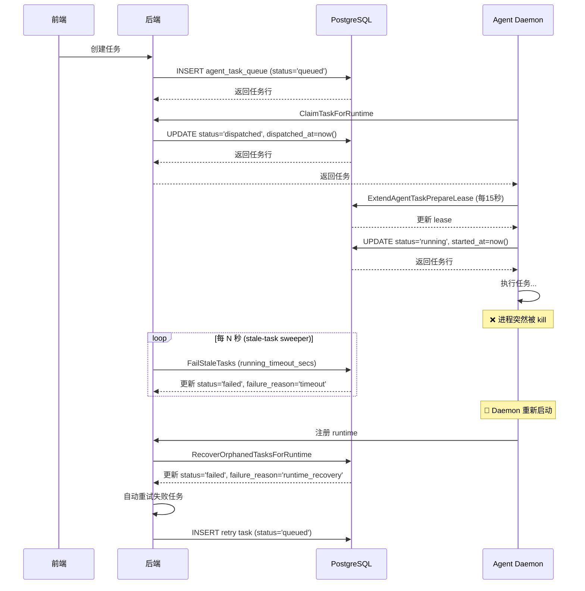
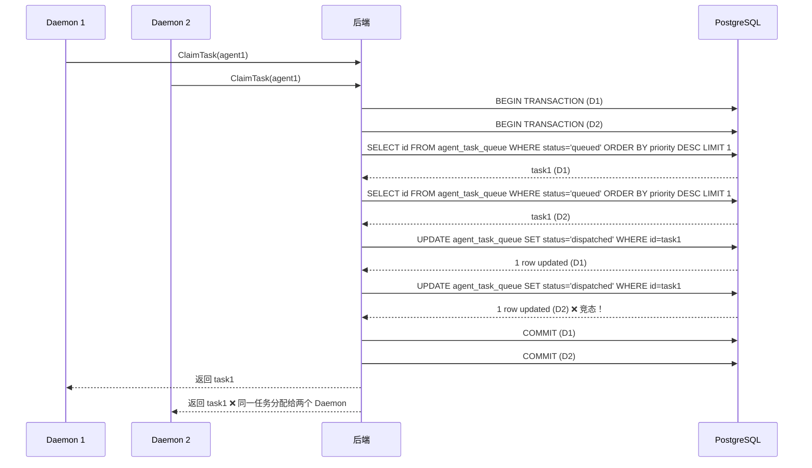
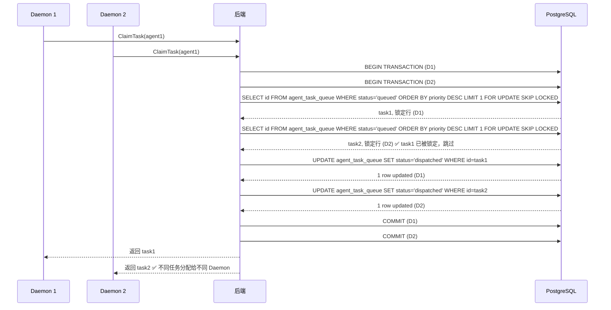

# 故障场景推演

## 场景 A：Agent 崩溃时的任务泄漏

### 问题描述

当 Agent Daemon 正在执行任务时，其进程突然被 kill（无优雅退出）。

### 代码追踪路径

**任务状态定义**：
```sql
-- server/migrations/109_agent_task_waiting_local_directory.up.sql:13
CHECK (status IN ('queued', 'dispatched', 'running', 'waiting_local_directory', 'completed', 'failed', 'cancelled'));
```

**后端感知 Agent 离线的机制**：

1. **心跳机制（HTTP + WebSocket）**：
```go
// server/internal/daemon/daemon.go:175-176
wsHBMu      sync.RWMutex         // guards wsHBLastAck
wsHBLastAck map[string]time.Time // runtime_id -> last successful WS heartbeat ack timestamp
```

2. **Daemon 启动时的任务恢复**：
```sql
-- server/pkg/db/queries/agent.sql:473-486
-- name: RecoverOrphanedTasksForRuntime :many
UPDATE agent_task_queue
SET status = 'failed',
    completed_at = now(),
    error = 'daemon restarted while task was in flight',
    failure_reason = 'runtime_recovery',
    wait_reason = NULL,
    prepare_lease_expires_at = NULL
WHERE runtime_id = $1 AND status IN ('dispatched', 'running', 'waiting_local_directory')
RETURNING *;
```

3. **任务超时机制**：
```sql
-- server/pkg/db/queries/agent.sql:491-523
-- name: FailStaleTasks :many
UPDATE agent_task_queue
SET status = 'failed', completed_at = now(), error = 'task timed out',
    failure_reason = 'timeout',
    prepare_lease_expires_at = NULL
WHERE (
    status = 'dispatched'
    AND dispatched_at < now() - make_interval(secs => @dispatch_timeout_secs::double precision)
    AND (prepare_lease_expires_at IS NULL OR prepare_lease_expires_at < now())
  )
   OR (status = 'running' AND started_at < now() - make_interval(secs => @running_timeout_secs::double precision))
RETURNING *;
```

### 状态变迁时序



### 结论

**是否存在任务永久卡在 "running" 状态的可能性？**

**不存在**

**判断依据：**

| 机制 | 触发条件 | 处理方式 | 代码位置 |
|------|---------|---------|---------|
| **Prepare Lease** | Daemon 崩溃且任务在 `dispatched` 状态 | lease 过期后可被回收 | `agent.sql:334-345` |
| **FailStaleTasks** | `running` 任务超过超时时间 | 标记为 `failed` | `agent.sql:491-523` |
| **RecoverOrphanedTasks** | Daemon 重启 | 恢复所有未完成任务 | `agent.sql:473-486` |
| **自动重试** | 任务失败 | 创建新任务重试 | `task.go:1634-1655` |

---

## 场景 B：并发任务分配的竞态条件

### 问题描述

两个 Agent 同时请求领取同一个 Task。

### 代码追踪路径

**任务认领的核心 SQL 查询**：

```sql
-- server/pkg/db/queries/agent.sql:272-310
-- name: ClaimAgentTask :one
UPDATE agent_task_queue
SET status = 'dispatched',
    dispatched_at = now(),
    prepare_lease_expires_at = now() + make_interval(secs => @prepare_lease_secs::double precision)
WHERE id = (
    SELECT atq.id FROM agent_task_queue atq
    WHERE atq.agent_id = $1 AND atq.status = 'queued'
      AND NOT EXISTS (
          SELECT 1 FROM agent_task_queue active
          WHERE active.agent_id = atq.agent_id
            AND active.status IN ('dispatched', 'running', 'waiting_local_directory')
            AND (
              (atq.issue_id IS NOT NULL AND active.issue_id = atq.issue_id)
              OR (atq.chat_session_id IS NOT NULL AND active.chat_session_id = atq.chat_session_id)
              OR (
                atq.issue_id IS NULL
                AND atq.chat_session_id IS NULL
                AND atq.autopilot_run_id IS NULL
                AND active.issue_id IS NULL
                AND active.chat_session_id IS NULL
                AND active.autopilot_run_id IS NULL
              )
            )
      )
    ORDER BY atq.priority DESC, atq.created_at ASC
    LIMIT 1
    FOR UPDATE SKIP LOCKED
)
RETURNING *;
```

**关键技术点**：
- `FOR UPDATE SKIP LOCKED`：PostgreSQL 的行级锁机制，跳过已被锁定的行
- 子查询中的 `NOT EXISTS`：防止同一 Agent 在同一 Issue 上运行多个任务
- 原子 UPDATE：整个操作在单个事务中完成

### 并发控制层次

| 层次 | 机制 | 作用 | 代码位置 |
|------|------|------|---------|
| **服务层** | `GetAgentForClaimUpdate`（FOR UPDATE） | 锁定 agent 行，防止同一 agent 的并发 claim | `task.go:984` |
| **服务层** | `CountRunningTasks` | 检查 max_concurrent_tasks 限制 | `task.go:992` |
| **SQL层** | `FOR UPDATE SKIP LOCKED` | 跳过已被其他事务锁定的 task 行 | `agent.sql:308` |
| **SQL层** | `NOT EXISTS` | 防止同一 agent 在同一 issue 上运行多个任务 | `agent.sql:289-305` |
| **事务层** | `runInTx` | 所有操作在同一事务中，保证原子性 | `task.go:982` |

### 竞态时序对比

**如果没有 FOR UPDATE SKIP LOCKED（竞态存在）**：



**实际情况（竞态被消除）**：



### 结论

**在高并发场景下，是否存在同一个 Task 被分配给两个 Agent 的可能？**

**不存在**

`FOR UPDATE SKIP LOCKED` 确保同一任务不会被两个事务同时选中，事务的原子性保证 UPDATE 操作的一致性。

---

## 场景 C：WebSocket 重连后的状态一致性

### 问题描述

Agent 与后端的 WebSocket 连接断开后重连。

### 代码追踪路径

**任务取消轮询**：

```go
// server/internal/daemon/daemon.go:229
cancelPollInterval time.Duration // how often handleTask polls for server-side cancellation; overridable in tests
```

```go
// server/internal/daemon/daemon.go:266
cancelPollInterval: 5 * time.Second,
```

**WS Disconnect 处理**：

```go
// server/internal/daemon/daemon.go:706-714
func (d *Daemon) clearWSHeartbeatAcks() {
	d.wsHBMu.Lock()
	for k := range d.wsHBLastAck {
		delete(d.wsHBLastAck, k)
	}
	d.wsHBMu.Unlock()
}
```

### 状态不一致场景分析

| 场景 | 不一致描述 | 不一致窗口 | 影响 |
|------|-----------|-----------|------|
| **任务取消延迟感知** | 断连期间任务被取消，Daemon 继续执行 | 最多 5 秒 | 浪费计算资源 |
| **任务超时延迟感知** | 断连期间任务超时，Daemon 继续执行 | 最多 5 秒 + 超时剩余时间 | 浪费计算资源 |
| **WS 事件丢失** | 断连期间的 `task:cancelled` 事件丢失 | 断连期间 | 任务继续执行 |

### 结论

**是否存在状态不一致的情况？**

**存在**

重连后，Agent 本地状态和后端状态**不完全一致**，存在最多 5 秒的状态不一致窗口（`cancelPollInterval`），断连期间的 WS 事件会丢失。

### 修复方案

**推荐方案：重连时立即触发一次任务取消检查**

```go
// server/internal/daemon/daemon.go
func (d *Daemon) onWSHeartbeatAck(runtimeID string) {
	d.recordWSHeartbeatAck(runtimeID)
	
	if !d.wsHeartbeatRecentlyAckedBefore(runtimeID) {
		d.logger.Debug("WS reconnected, triggering immediate task status check",
			"runtime_id", runtimeID)
		go d.checkAllRunningTasks(runtimeID)
	}
}

func (d *Daemon) checkAllRunningTasks(runtimeID string) {
	ctx := context.Background()
	tasks, err := d.client.GetRunningTasks(ctx, runtimeID)
	if err != nil {
		return
	}
	for _, task := range tasks {
		if task.Status != "running" {
			d.stopTask(task.ID)
		}
	}
}
```

**收益**：重连后立即检查，消除最多 5 秒的延迟窗口。

---

## 代码证据清单

| 场景 | 文件路径 | 行号 | 关键代码 | 作用 |
|------|---------|------|---------|------|
| **场景 A** | `server/pkg/db/queries/agent.sql` | 473-486 | `RecoverOrphanedTasksForRuntime` | Daemon 重启时恢复任务 |
| **场景 A** | `server/pkg/db/queries/agent.sql` | 491-523 | `FailStaleTasks` | 定时扫瞄超时任务 |
| **场景 A** | `server/pkg/db/queries/agent.sql` | 334-345 | `ExtendAgentTaskPrepareLease` | prepare lease 机制 |
| **场景 B** | `server/pkg/db/queries/agent.sql` | 272-310 | `ClaimAgentTask` SQL | 核心任务认领查询 |
| **场景 B** | `server/pkg/db/queries/agent.sql` | 308 | `FOR UPDATE SKIP LOCKED` | 跳过已锁定的行 |
| **场景 B** | `server/internal/service/task.go` | 982 | `s.runInTx` | 事务包裹 |
| **场景 C** | `server/internal/daemon/daemon.go` | 229 | `cancelPollInterval` | 任务取消轮询间隔 |
| **场景 C** | `server/internal/daemon/daemon.go` | 266 | `cancelPollInterval: 5 * time.Second` | 默认轮询间隔 |
| **场景 C** | `server/internal/daemon/daemon.go` | 706-714 | `clearWSHeartbeatAcks()` | WS 断开时清除 ack 记录 |