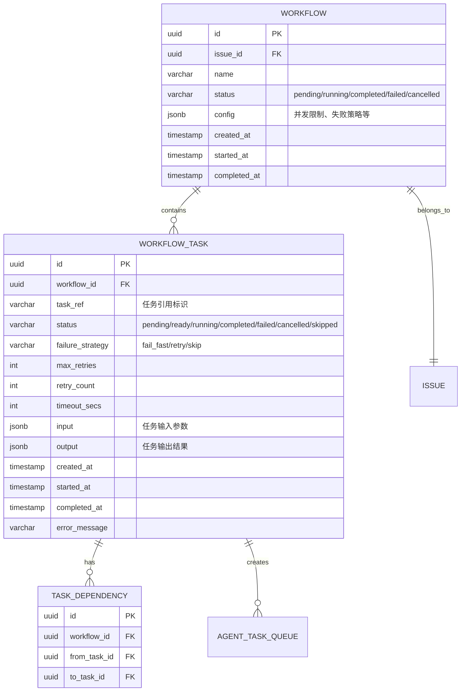
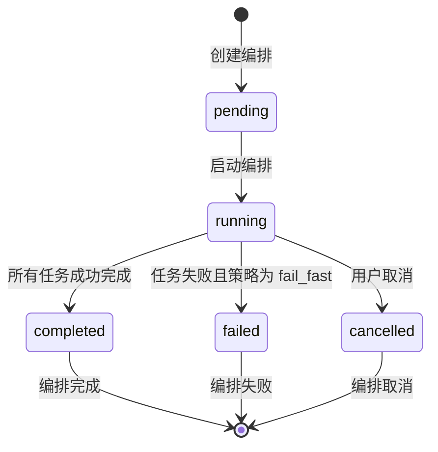
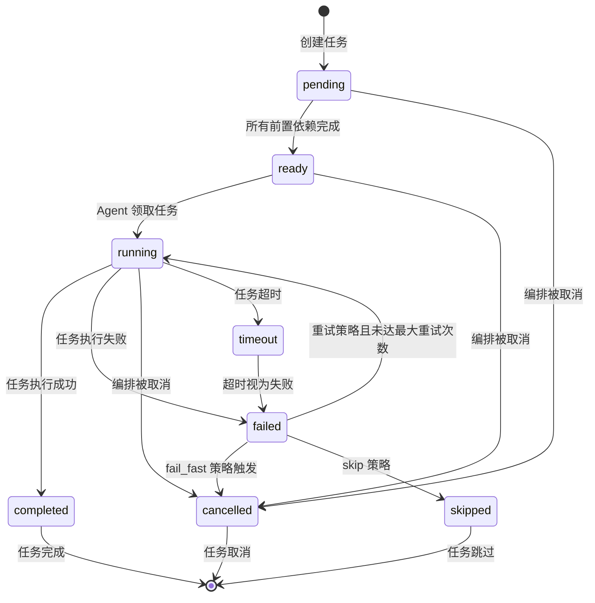

# 多 Agent 任务编排引擎 - 设计文档

## 一、概述

当前 Multica 的 Squad 功能中，Leader Agent 分解任务后分配给成员，但任务之间是独立的，没有依赖关系。本设计文档旨在构建一个**任务编排引擎**，支持有依赖关系的复杂工作流，形成 DAG（有向无环图）。

---

## 二、数据模型

### 2.1 ER 图



### 2.2 表结构详细定义

#### 2.2.1 `workflow` 表

| 字段名 | 类型 | 约束 | 说明 |
|--------|------|------|------|
| `id` | UUID | PRIMARY KEY | 编排唯一标识 |
| `issue_id` | UUID | FOREIGN KEY | 关联的 Issue ID |
| `name` | VARCHAR(255) | NOT NULL | 编排名称 |
| `status` | VARCHAR(32) | NOT NULL, CHECK | 编排状态 |
| `config` | JSONB | | 编排配置 |
| `created_at` | TIMESTAMP | NOT NULL | 创建时间 |
| `started_at` | TIMESTAMP | | 开始时间 |
| `completed_at` | TIMESTAMP | | 完成时间 |

#### 2.2.2 `workflow_task` 表

| 字段名 | 类型 | 约束 | 说明 |
|--------|------|------|------|
| `id` | UUID | PRIMARY KEY | 任务唯一标识 |
| `workflow_id` | UUID | FOREIGN KEY, NOT NULL | 所属编排 ID |
| `task_ref` | VARCHAR(255) | NOT NULL | 任务引用标识 |
| `status` | VARCHAR(32) | NOT NULL, CHECK | 任务状态 |
| `failure_strategy` | VARCHAR(16) | NOT NULL | 失败策略 |
| `max_retries` | INT | DEFAULT 0 | 最大重试次数 |
| `retry_count` | INT | DEFAULT 0 | 当前重试次数 |
| `timeout_secs` | INT | DEFAULT 0 | 超时时间 |
| `input` | JSONB | | 任务输入参数 |
| `output` | JSONB | | 任务输出结果 |
| `created_at` | TIMESTAMP | NOT NULL | 创建时间 |
| `started_at` | TIMESTAMP | | 开始时间 |
| `completed_at` | TIMESTAMP | | 完成时间 |
| `error_message` | TEXT | | 错误信息 |

#### 2.2.3 `task_dependency` 表

| 字段名 | 类型 | 约束 | 说明 |
|--------|------|------|------|
| `id` | UUID | PRIMARY KEY | 依赖关系唯一标识 |
| `workflow_id` | UUID | FOREIGN KEY, NOT NULL | 所属编排 ID |
| `from_task_id` | UUID | FOREIGN KEY, NOT NULL | 前置任务 ID |
| `to_task_id` | UUID | FOREIGN KEY, NOT NULL | 后续任务 ID |

---

## 三、状态机

### 3.1 Workflow 状态机



### 3.2 Workflow Task 状态机



---

## 四、核心算法

### 4.1 DAG 的存储和查询方式

使用邻接表存储 DAG：

```sql
CREATE TABLE task_dependency (
    workflow_id UUID NOT NULL,
    from_task_id UUID NOT NULL,
    to_task_id UUID NOT NULL,
    PRIMARY KEY (workflow_id, from_task_id, to_task_id)
);
```

### 4.2 判断任务前置依赖是否全部完成

**算法描述**：
1. 获取任务的所有前置依赖
2. 检查每个前置任务的状态
3. 如果所有前置任务状态为 `completed` 或 `skipped` → 依赖完成

### 4.3 循环依赖检测

**算法选择**：深度优先搜索（DFS）检测有向图中的环

**状态标记**：
- `white`：未访问
- `gray`：正在访问（当前路径中）
- `black`：已访问完成

**时间复杂度**：O(V + E)，其中 V 是任务数，E 是依赖关系数

---

## 五、API 设计

### 5.1 接口列表

| 接口 | 方法 | 路径 | 说明 |
|------|------|------|------|
| 创建编排 | POST | `/api/workflows` | 创建新的编排实例 |
| 获取编排 | GET | `/api/workflows/{id}` | 获取编排详情 |
| 启动编排 | POST | `/api/workflows/{id}/start` | 启动编排 |
| 取消编排 | POST | `/api/workflows/{id}/cancel` | 取消编排 |
| 添加任务 | POST | `/api/workflows/{id}/tasks` | 向编排添加任务 |
| 添加依赖 | POST | `/api/workflows/{id}/dependencies` | 添加任务依赖关系 |
| 领取任务 | POST | `/api/workflows/{id}/claim` | Agent 领取就绪任务 |
| 完成任务 | POST | `/api/workflows/{id}/tasks/{taskID}/complete` | 标记任务完成 |
| 失败任务 | POST | `/api/workflows/{id}/tasks/{taskID}/fail` | 标记任务失败 |

---

## 六、并发与一致性

### 6.1 多个 Agent 同时请求领取任务

复用项目现有的 `FOR UPDATE SKIP LOCKED` 机制：

```sql
UPDATE workflow_task
SET status = 'running', started_at = now()
WHERE id = (
    SELECT t.id FROM workflow_task t
    WHERE t.workflow_id = $1 AND t.status = 'ready'
    ORDER BY t.created_at ASC
    LIMIT 1
    FOR UPDATE SKIP LOCKED
)
RETURNING *;
```

### 6.2 任务状态变更的原子性保证

1. **数据库事务**：所有状态变更操作在数据库事务中执行
2. **乐观锁**：添加 `version` 字段，更新时检查版本号

### 6.3 并发任务数限制

在数据库层面进行计数检查，只有当运行中任务数 < 最大并发数时，才能领取新任务。

---

## 七、Trade-off 分析

### 7.1 DAG 存储方式选择

**选择邻接表**：当前系统的任务编排规模预计不会太大，邻接表的性能完全足够，灵活性和可维护性更重要。

### 7.2 循环依赖检测时机

**选择添加依赖时检测**：及早发现问题，提供更好的用户体验。

### 7.3 任务状态同步机制

**选择轮询机制**：简单可靠，复用现有任务取消轮询机制。

---

## 八、架构设计总结

### 8.1 核心组件职责

| 组件 | 职责 |
|------|------|
| **Orchestrator** | 编排引擎核心，负责任务调度、状态管理、失败处理 |
| **Workflow Manager** | 编排生命周期管理 |
| **Task Manager** | 任务状态管理 |
| **Dependency Manager** | 依赖关系管理 |

### 8.2 关键设计决策

1. **基于数据库的状态持久化**：所有状态存储在 PostgreSQL 中
2. **事务性状态变更**：所有状态变更在数据库事务中执行
3. **FOR UPDATE SKIP LOCKED 并发控制**：复用项目现有机制
4. **添加依赖时检测环**：及早发现问题
5. **轮询式状态同步**：简单可靠