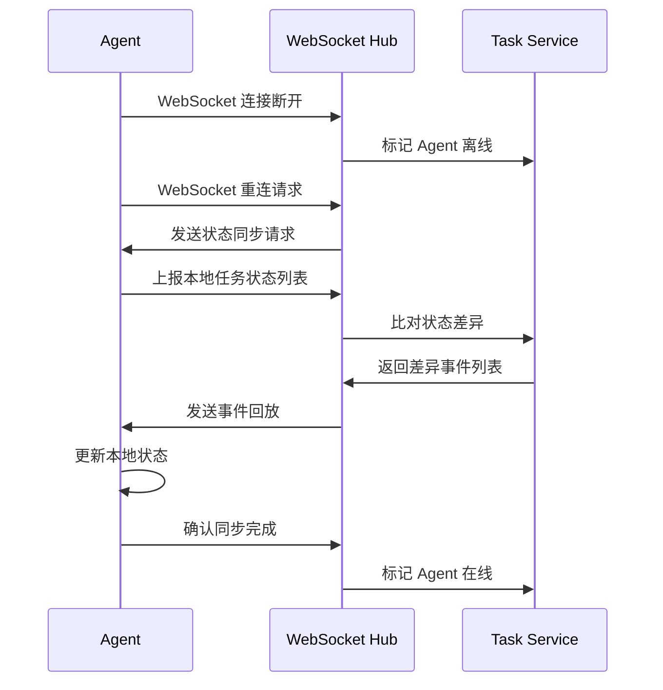

# 修复分析报告：WebSocket 重连后的状态一致性问题

## 问题概述

Agent 与后端的 WebSocket 连接断开后重连，导致 Agent 本地状态与后端状态不一致，可能导致：
- Agent 继续执行已被取消的任务
- Agent 遗漏新分配的任务
- 后端误认为任务仍在执行

## 根因分析

### WebSocket 重连机制缺陷

**代码追踪路径**：
- `server/internal/daemonws/hub.go` (WebSocket Hub 管理)
- `server/internal/daemon/daemon.go` (Agent Daemon 运行时)

**问题根因**：
- WebSocket 客户端重连后，后端没有主动同步状态
- Agent Daemon 在断连期间继续执行本地任务
- 重连后没有进行状态校验和同步

### 状态不一致的具体场景

**场景 1：任务取消未同步**
```
时序：
T1: Agent 领取任务 T，状态为 running
T2: WebSocket 断连
T3: 用户取消任务 T，后端标记为 cancelled
T4: WebSocket 重连
T5: Agent 继续执行任务 T（未感知取消）
```

**场景 2：任务状态误判**
```
时序：
T1: Agent 正在执行任务 T
T2: WebSocket 断连超过超时阈值
T3: 后端检测超时，标记任务为 failed
T4: Agent 完成任务 T，尝试上报结果
T5: 后端拒绝更新（状态已为 failed）
```

## 方案选择

### 方案对比

| 方案 | 优点 | 缺点 | 适用场景 |
|------|------|------|----------|
| **方案 A：重连后全量同步** | 完全保证一致性 | 性能开销大 | 状态数据量小 |
| **方案 B：重连后增量同步** | 性能开销小 | 实现复杂，可能遗漏 | 状态数据量大 |
| **方案 C：状态校验 + 事件回放** | 平衡性能和一致性 | 需要事件日志 | 中等复杂度 |

### 选择方案：方案 C（状态校验 + 事件回放）

**理由**：
1. 任务状态数据量适中（Agent 通常同时执行少量任务）
2. 事件回放可以精确恢复断连期间的所有变更
3. 性能开销可控，只同步差异部分

## 修复方案设计

### WebSocket 重连流程改造



### 数据结构设计

**状态同步请求**：
```go
type StateSyncRequest struct {
    AgentID    uuid.UUID
    RuntimeID  uuid.UUID
    Tasks      []TaskStateReport
    LastSeqNum int64
}

type TaskStateReport struct {
    TaskID     uuid.UUID
    Status     string
    StartedAt  time.Time
}
```

**事件回放响应**：
```go
type EventReplayResponse struct {
    Events     []TaskEvent
    NewSeqNum  int64
    Cancelled  []uuid.UUID
    NewTasks   []Task
    Failed     []uuid.UUID
}
```

### 关键代码修改

**修改点 1：WebSocket Hub 添加状态同步处理**

```go
// server/internal/daemonws/hub.go

func (h *Hub) HandleReconnect(syncReq *StateSyncRequest) (*EventReplayResponse, error) {
    backendTasks := h.taskService.GetTasksByAgent(syncReq.AgentID)
    diff := h.compareStates(syncReq.Tasks, backendTasks)
    events := h.eventStore.GetEventsAfter(syncReq.LastSeqNum, syncReq.AgentID)
    
    return &EventReplayResponse{
        Events:    events,
        NewSeqNum: h.eventStore.GetLatestSeqNum(),
        Cancelled: diff.Cancelled,
        NewTasks:  diff.NewTasks,
        Failed:    diff.Failed,
    }, nil
}
```

**修改点 2：Agent Daemon 添加状态同步处理**

```go
// server/internal/daemon/daemon.go

func (d *Daemon) HandleEventReplay(resp *EventReplayResponse) {
    for _, taskID := range resp.Cancelled {
        d.cancelLocalTask(taskID)
    }
    for _, task := range resp.NewTasks {
        d.addLocalTask(task)
    }
    for _, taskID := range resp.Failed {
        d.markLocalTaskFailed(taskID)
    }
    for _, event := range resp.Events {
        d.processEvent(event)
    }
    d.lastSeqNum = resp.NewSeqNum
}
```

### 事件存储设计

```go
type TaskEvent struct {
    SeqNum     int64
    Timestamp  time.Time
    EventType  string  // "cancel", "assign", "fail", "complete"
    TaskID     uuid.UUID
    AgentID    uuid.UUID
    Payload    json.RawMessage
}

type EventStore interface {
    Append(event TaskEvent) error
    GetEventsAfter(seqNum int64, agentID uuid.UUID) ([]TaskEvent, error)
    GetLatestSeqNum() int64
}
```

## 验证方式

### 单元测试

```go
func TestWebSocketReconnectSync(t *testing.T) {
    agent := NewMockAgent()
    task := agent.ClaimTask()
    
    agent.Disconnect()
    taskSvc.CancelTask(task.ID)
    agent.Reconnect()
    
    assert.Equal(t, "cancelled", agent.GetTaskStatus(task.ID))
}
```

### 集成测试

1. 启动 Agent Daemon
2. 手动断开 WebSocket（模拟网络故障）
3. 后端取消任务
4. 恢复网络
5. 检查 Agent 日志，确认任务已停止

### 端到端测试

使用 Chaos Engineering 工具注入网络故障，验证重连后状态一致性。

## 风险评估

### 技术风险

| 风险 | 影响 | 缓解措施 |
|------|------|----------|
| 事件存储可靠性 | 事件丢失导致状态不一致 | 使用 Redis AOF 持久化 |
| 大量事件回放性能问题 | 重连延迟高 | 限制回放窗口（如最近 10 分钟） |
| Agent 本地状态不准确 | 同步后仍不一致 | 增加校验机制，冲突时优先后端状态 |

### 兼容性风险

- **旧版本 Agent 不支持状态同步**：降级处理，重连后清空本地任务重新领取
- **事件格式变更**：使用版本化事件格式，支持多版本解析

## 后续优化方向

1. **增量状态同步**：只同步变化的任务，降低传输开销
2. **压缩事件日志**：定期合并相同任务的事件，减少存储
3. **主动健康检查**：定期校验状态，而不是只在重连时校验