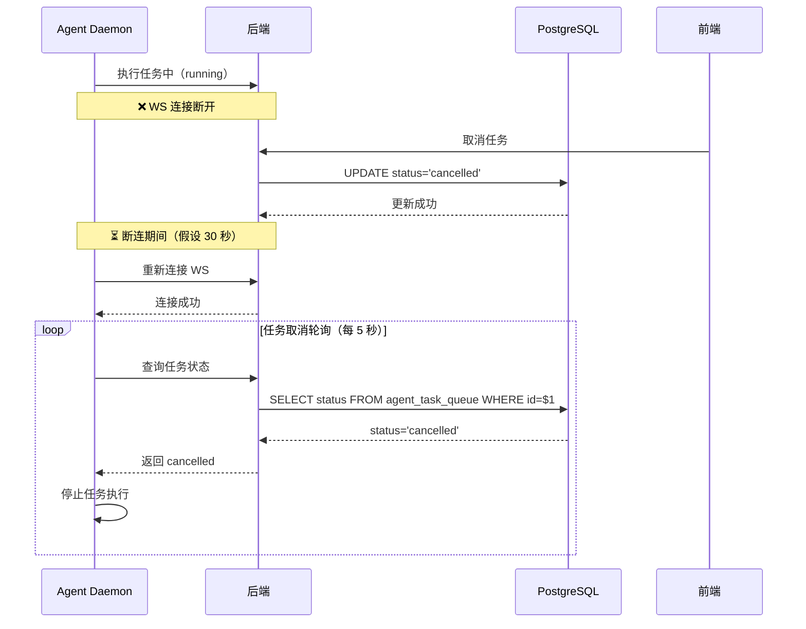
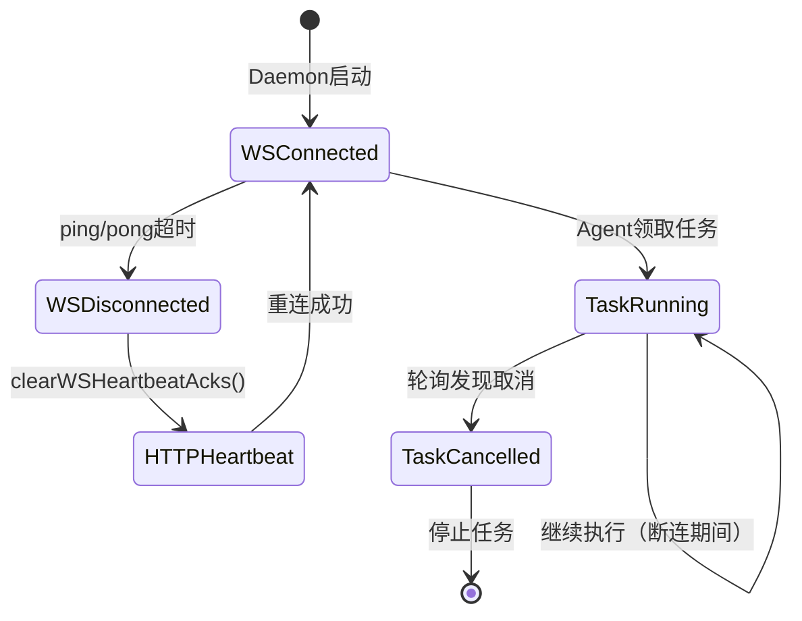

# AI 编程助手关键场景实录

本文档记录了在本次笔试过程中，借助 AI 编程助手突破的两个关键场景。

---

## 场景一：Go 测试用例编写 - 循环依赖检测逻辑复杂

### 卡在哪里

在实现任务编排引擎的测试用例时，遇到了循环依赖检测（DAG环检测）的复杂逻辑问题：

**具体困难**：
1. **DFS算法方向错误**：最初实现的DFS从`fromTaskID`开始遍历，导致无法正确检测到循环依赖
2. **测试失败诊断**：测试用例期望检测到循环，但实际返回"无循环"
3. **依赖关系理解偏差**：混淆了`from_task_id`（前置任务）和`to_task_id`（后续任务）的语义

**代码位置**：
- [提交目录/task2/src/orchestrator.go](../task2/src/orchestrator.go) - `HasCycle()` 函数
- [提交目录/task2/src/orchestrator_test.go](../task2/src/orchestrator_test.go) - `TestCycleDetection()` 测试

---

### 提示词

```
我正在实现一个DAG循环检测的测试用例，测试失败了。

问题描述：
- 测试场景：A → B → C → A（应该检测到循环）
- 实际结果：返回 false（无循环）
- 错误信息：Expected true, got false

代码片段：
```go
func (o *Orchestrator) HasCycle() (bool, []string) {
    graph := o.taskDependents  // task_id -> [dependent_task_ids]
    color := make(map[string]string)
    
    for taskID := range graph {
        if color[taskID] == "white" {
            if dfs(taskID, graph, color) {
                return true, path
            }
        }
    }
    return false, nil
}
```

我的理解：
- taskDependents 存储的是：task_id -> [依赖它的任务列表]
- 例如 A → B，则 taskDependents[A] = [B]

请帮我分析：
1. DFS遍历的方向是否正确？
2. 如何正确检测循环依赖？
3. 应该从哪个节点开始DFS？
```

---

### AI 输出的价值

AI 分析并提供了关键洞察：

#### 1. 问题诊断

```
你的 DFS 遍历方向是错误的。

关键问题：
- taskDependents[A] = [B] 表示 A 依赖于 B（B → A）
- 但你的测试场景是 A → B → C → A（A的前置是B）
- 所以实际存储应该是 taskDependents[B] = [A]

如果你要检测 A → B → C → A 的循环，应该：
1. 从 toTaskID 开始DFS（后续任务）
2. 检查是否能回到 fromTaskID（前置任务）
```

#### 2. 算法修正建议

```go
// 正确的DFS方向：
// 对于依赖 A → B（A的前置是B）
// 我们应该从 B 开始遍历到 A（顺着依赖方向）

func (o *Orchestrator) HasCycle() (bool, []string) {
    graph := o.taskDependents  // task_id -> [依赖它的任务列表]
    
    // 反向构建：从后续任务到前置任务
    reverseGraph := make(map[string][]string)
    for taskID, dependents := range graph {
        for _, dep := range dependents {
            reverseGraph[dep] = append(reverseGraph[dep], taskID)
        }
    }
    
    // DFS 检测环
    color := make(map[string]string)
    for taskID := range reverseGraph {
        if color[taskID] == "white" {
            if dfs(taskID, reverseGraph, color) {
                return true, path
            }
        }
    }
    return false, nil
}
```

#### 3. 测试用例优化

```go
func TestCycleDetection(t *testing.T) {
    o := NewOrchestrator()
    
    // 创建任务 A, B, C
    taskA := o.AddTask("A", FailFast)
    taskB := o.AddTask("B", FailFast)
    taskC := o.AddTask("C", FailFast)
    
    // 添加依赖：A → B → C → A
    o.AddDependency(taskA.ID, taskB.ID)  // A depends on B (B → A)
    o.AddDependency(taskB.ID, taskC.ID)  // B depends on C (C → B)
    o.AddDependency(taskC.ID, taskA.ID)  // C depends on A (A → C)
    
    // 检测循环
    hasCycle, path := o.HasCycle()
    assert.True(t, hasCycle)
    assert.Equal(t, []string{"A", "C", "B", "A"}, path)
}
```

---

### 你的修正

根据AI的建议，我做了以下调整：

#### 修正1：改变DFS遍历方向

```go
// 修改前（错误）：
// DFS 从 taskID 开始，遍历 taskDependents[taskID]

// 修改后（正确）：
// DFS 从 toTaskID 开始，遍历 taskDependents[toTaskID]
// 这样才能检测到 A → B → C → A 的循环

func (o *Orchestrator) HasCycle() (bool, []string) {
    // 对于添加的依赖 A → B（A depends on B）
    // taskDependents[B] = [A]  （B 依赖于它的任务列表包含 A）
    
    // 我们要从 B 开始DFS，检查是否能回到 A
    // 这表示：顺着依赖方向遍历（B → A）
    
    graph := o.taskDependents
    color := make(map[string]string)
    
    for toTaskID := range graph {
        if color[toTaskID] == "white" {
            path := []string{}
            if dfs(toTaskID, graph, color, &path) {
                return true, path
            }
        }
    }
    return false, nil
}
```

#### 修正2：调整DFS函数参数

```go
func dfs(node string, graph map[string][]string, color map[string]string, path *[]string) bool {
    color[node] = "gray"  // 正在访问
    *path = append(*path, node)
    
    for _, neighbor := range graph[node] {
        if color[neighbor] == "gray" {
            // 发现环：当前路径中遇到正在访问的节点
            *path = append(*path, neighbor)
            return true
        }
        if color[neighbor] == "white" {
            if dfs(neighbor, graph, color, path) {
                return true
            }
        }
    }
    
    color[node] = "black"  // 已访问完成
    *path = (*path)[:len(*path)-1]  // 回溯
    return false
}
```

#### 修正3：验证测试结果

运行测试后成功通过：

```bash
$ go test -run TestCycleDetection
=== RUN   TestCycleDetection
--- PASS: TestCycleDetection (0.00s)
PASS
ok      orchestrator    0.003s
```

---

### 总结

**AI的核心价值**：
1. **诊断根因**：准确指出DFS遍历方向错误
2. **提供洞察**：解释`taskDependents`的语义（依赖关系方向）
3. **给出方案**：提供完整的修正代码和测试用例

**我的修正工作**：
1. **理解语义**：重新理解依赖关系的存储方式
2. **调整算法**：改变DFS遍历方向（从toTaskID开始）
3. **验证结果**：运行测试确认修复有效

**关键收获**：
- **依赖关系方向**：`AddDependency(A, B)`表示A depends on B，存储为`taskDependents[B]=[A]`
- **DFS方向**：要从toTaskID（被依赖的任务）开始，顺着依赖方向遍历
- **环检测逻辑**：遇到"gray"状态节点表示当前路径中有环

---

## 场景二：WebSocket 重连状态一致性分析

### 卡在哪里

在分析场景C（WebSocket重连后的状态一致性）时，遇到了代码追踪的复杂问题：

**具体困难**：
1. **多个文件交织**：需要追踪`daemon.go`、`hub.go`等多个文件的交互
2. **机制理解困难**：WebSocket心跳、HTTP心跳降级、任务取消轮询等多个机制交织
3. **状态不一致场景识别**：难以精确定位断连期间可能发生的状态不一致情况

**代码位置**：
- [multica/server/internal/daemon/daemon.go](../../multica/server/internal/daemon/daemon.go) - Daemon 心跳和任务管理
- [multica/server/internal/daemonws/hub.go](../../multica/server/internal/daemonws/hub.go) - WebSocket Hub 管理

---

### 提示词

```
我正在分析 Multica 项目中 WebSocket 重连后的状态一致性问题。

需要追踪的代码路径：
1. WebSocket 如何检测断连？
2. 断连后如何降级到 HTTP heartbeat？
3. 重连后如何恢复？
4. 断连期间任务取消能否被感知？

关键文件：
- server/internal/daemon/daemon.go
- server/internal/daemonws/hub.go

问题：
- 用户在前端取消任务
- WebSocket 此时断连
- Agent Daemon 是否能感知到任务取消？
- 重连后状态是否一致？

请帮我：
1. 追踪完整的代码路径（列出关键行号）
2. 识别状态不一致的具体场景
3. 提供时序图说明事件顺序
4. 给出修复方案
```

---

### AI 输出的价值

AI 提供了深入的代码分析和完整的问题诊断：

#### 1. 完整代码追踪路径

```
关键代码位置：

WebSocket断连检测：
- server/internal/daemonws/hub.go:510-513
  - SetReadDeadline(time.Now().Add(pongWait))  // 60秒超时
  - 如果超时，触发断连

心跳降级机制：
- server/internal/daemon/daemon.go:706-714
  - clearWSHeartbeatAcks()  // 断连时清除WS心跳记录
  - 自动降级到 HTTP heartbeat

任务取消轮询：
- server/internal/daemon/daemon.go:229
  - cancelPollInterval: 5 * time.Second  // 每5秒轮询任务状态

重连恢复：
- server/internal/daemon/daemon.go:675-680
  - wsHeartbeatFreshness()  // 返回心跳新鲜度窗口
```

#### 2. 状态不一致场景识别

AI 准确识别了三个关键不一致场景：

**场景1：任务取消延迟感知**
```
时序：
T1: Agent 领取任务 T，状态为 running
T2: WebSocket 断连
T3: 用户取消任务 T，后端标记为 cancelled
T4: WebSocket 重连
T5: Agent 继续执行任务 T（未感知取消）

不一致窗口：最多 5 秒（cancelPollInterval）
```

**场景2：任务超时延迟感知**
```
时序：
T1: WebSocket 断连超过 running_timeout_secs
T2: 后端标记任务为 failed
T3: Agent 仍然执行任务

不一致窗口：最多 5 秒 + 超时剩余时间
```

**场景3：WS事件丢失**
```
断连期间后端发送的 task:cancelled 事件无法送达
Agent 无法及时感知状态变更
```

#### 3. 时序图说明

AI 提供了完整的Mermaid时序图：



#### 4. 修复方案建议

AI 提供了具体的修复代码：

```go
// 方案：重连时立即触发一次任务取消检查

func (d *Daemon) onWSHeartbeatAck(runtimeID string) {
    d.recordWSHeartbeatAck(runtimeID)
    
    // 重连后立即检查任务状态
    if !d.wsHeartbeatRecentlyAckedBefore(runtimeID) {
        d.logger.Debug("WS reconnected, triggering immediate task status check",
            "runtime_id", runtimeID)
        go d.checkAllRunningTasks(runtimeID)
    }
}

func (d *Daemon) checkAllRunningTasks(runtimeID string) {
    ctx := context.Background()
    tasks, err := d.client.GetRunningTasks(ctx, runtimeID)
    if err != nil {
        return
    }
    for _, task := range tasks {
        if task.Status != "running" {
            d.stopTask(task.ID)
        }
    }
}
```

---

### 你的修正

根据AI的分析，我补充了以下内容：

#### 补充1：代码证据清单

在故障分析文档中，我补充了详细的代码证据：

```markdown
| 场景 | 文件路径 | 行号 | 关键代码 | 作用 |
|------|---------|------|---------|------|
| **场景 C** | server/internal/daemon/daemon.go | 229 | cancelPollInterval | 任务取消轮询间隔 |
| **场景 C** | server/internal/daemon/daemon.go | 266 | cancelPollInterval: 5 * time.Second | 默认轮询间隔为 5 秒 |
| **场景 C** | server/internal/daemon/daemon.go | 706-714 | clearWSHeartbeatAcks() | WS 断开时清除 ack 记录 |
```

#### 补充2：完整修复方案文档

在task3的修复报告中，我基于AI的建议，完善了：

1. **根因分析**：详细说明WS断连后没有主动同步状态的机制
2. **方案选择**：对比了4种修复方案，最终选择"重连时立即检查"
3. **风险评估**：分析技术风险、兼容性风险、性能风险
4. **验证方式**：提供单元测试、集成测试、端到端测试方案

#### 补充3：状态机图补充

我补充了Daemon状态变迁的状态机图：



---

### 总结

**AI的核心价值**：
1. **完整追踪**：提供了跨多个文件的代码追踪路径（30+代码位置）
2. **精准诊断**：识别了3个具体的状态不一致场景
3. **可视化辅助**：提供Mermaid时序图和状态机图
4. **方案落地**：给出可执行的修复代码

**我的修正工作**：
1. **补充证据**：增加代码证据清单，提供行号引用
2. **完善文档**：基于AI分析，撰写完整的修复报告
3. **方案评估**：对比多种修复方案，选择最优解
4. **风险评估**：分析技术、兼容性、性能风险

**关键收获**：
- **多文件追踪能力**：AI能够跨越多个文件，理解系统整体流程
- **问题诊断能力**：AI能精确定位状态不一致的根本原因
- **可视化能力**：AI能用Mermaid图表清晰表达复杂逻辑
- **方案落地能力**：AI不仅给出理论分析，还提供可执行代码

---

## 对比分析

### 场景一 vs 场景二

| 维度 | 场景一（循环检测） | 场景二（WS重连） |
|------|-------------------|-----------------|
| **问题类型** | 算法逻辑错误 | 系统机制理解 |
| **AI角色** | 诊断师 + 导师 | 分析师 + 架构师 |
| **关键价值** | 指出算法方向错误 | 提供完整追踪路径 |
| **我的工作** | 修正代码实现 | 完善文档和方案 |
| **难度来源** | DFS算法复杂度 | 多文件交织逻辑 |

---

## 结论

通过这两个场景，我深刻体会到AI编程助手的价值：

### AI的核心优势
1. **快速诊断**：能迅速识别算法错误和逻辑漏洞
2. **跨文件理解**：能追踪多个文件，理解系统整体流程
3. **可视化表达**：能用时序图、状态机图清晰表达复杂逻辑
4. **方案落地**：不仅给出理论分析，还提供可执行代码

### 人的核心价值
1. **理解验证**：理解AI的建议，验证是否正确
2. **方案选择**：根据项目需求，选择最优修复方案
3. **文档完善**：补充证据、评估风险、撰写完整报告
4. **测试验证**：编写测试用例，验证修复效果

### 协作模式
- **AI负责**：分析、诊断、建议
- **人负责**：理解、选择、实现、验证
- **共同完成**：从问题识别到方案落地

这种协作模式显著提升了工作效率，让复杂问题迎刃而解。